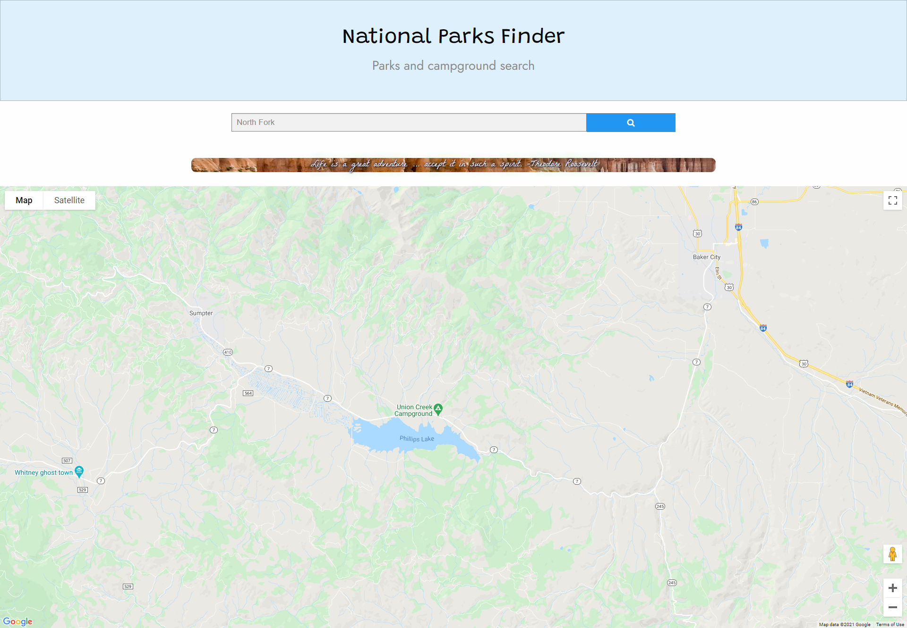

# Project 1 - Campground Finder App


## Description

An application that helps you find campgrounds and area information. Other information such as fire bans, permits, availability, and alerts show in results. 


```
## User Story

AS A USER I want to be able to enter a campground
WHEN I enter a campground
THEN I am given information about the campground, including fire bans, restrictions, permits, availability.
```

## Mock-Up
The following images shows the web application's appearance and functionality:




## Technologies Applied
* HTML
* CSS
* JavaScript
* Web-API’s


## Web API’s Used
- * Recreation.gov https://ridb.recreation.gov/docs*
- * Google Maps API

## Links
* **[Repository](#https://github.com/CobaltFrostfish/NP-fun-finder)**
* **[Live site](#https://cobaltfrostfish.github.io/NP-fun-finder/)**

## Contributors

Chris Whalen, Evan Mora, Jared Neisen, Kendra Wing

# NP-fun-finder
This is for me creating the api calls for our project

